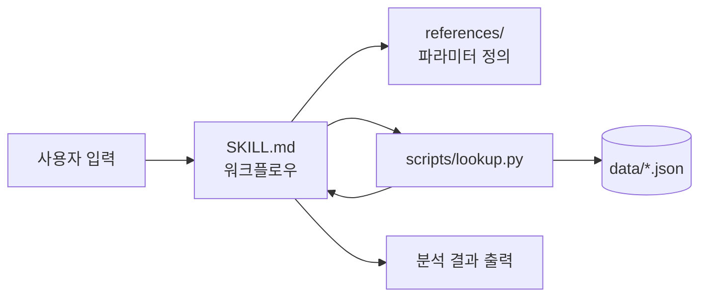
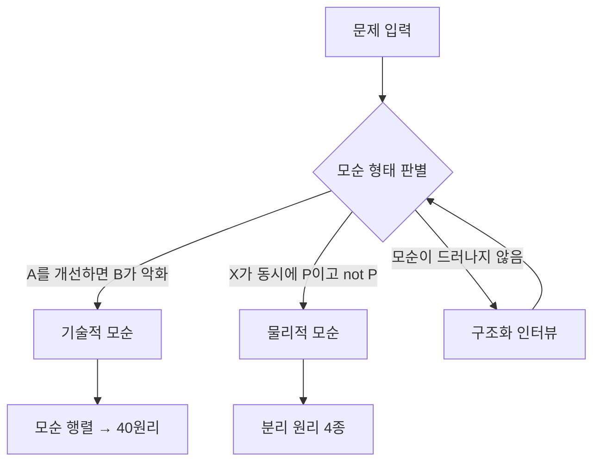

# TRIZ Solver 플러그인 설계서

2026-09-23 · 서도경

## 1. 개요

TRIZ Solver는 기술적·물리적 모순을 TRIZ 방법론으로 분석해 해결 아이디어를 도출하는 **오픈소스 Claude Code 플러그인**이다. 서버·DB·API 키 없이 동작하며, 추론은 사용자의 Claude가, 행렬 조회는 결정적 스크립트가 담당한다.

### 1.1 목적

- 공학·제품 문제를 **모순(contradiction)** 형태로 구조화하도록 유도
- 모순 행렬 조회를 LLM 기억이 아닌 **데이터 파일 기반 결정적 조회**로 수행해 환각 제거
- 공개 GitHub 저장소 + Claude 공식 Plugin Directory 등재

### 1.2 비목표

- 수익화, 과금, 사용자 계정
- 웹 UI (기존 Next.js 계획은 보류, 추후 동일 데이터 재사용)
- 범용 비즈니스 의사결정 지원 (저작권 있는 비즈니스 행렬 미사용)
- 특허 DB 검색 (v1.0 이후 검토)

### 1.3 대상 사용자

| 사용자 | 사용 시나리오 |
| --- | --- |
| 개인 발명가·1인 개발자 | 제품 설계 중 트레이드오프 해소 |
| 기업 R&D 엔지니어 | 개선 과제, 문제해결 워크숍 사전 분석 |
| TRIZ 학습자·강사 | 모순 정의 → 원리 적용 과정 실습 |

## 2. 요구사항

v0.1은 기술적 모순 흐름 1개만 완성하고, 물리적 모순과 인터뷰 흐름은 v0.2로 미룬다.

### 2.1 기능 요구사항

| ID | 요구사항 | 릴리스 |
| --- | --- | --- |
| FR-01 | 자연어 문제 입력을 받아 개선 파라미터·악화 파라미터 후보를 39개 중에서 선정하고 근거를 제시 | v0.1 |
| FR-02 | 파라미터 쌍으로 모순 행렬을 스크립트로 조회해 발명 원리 번호 반환 | v0.1 |
| FR-03 | 반환된 원리별로 사용자 문제에 맞춘 구체적 적용 아이디어 생성 | v0.1 |
| FR-04 | 파라미터 후보가 여러 개일 때 상위 2\~3개 조합을 모두 조회해 원리 빈도 집계 | v0.1 |
| FR-05 | `/triz` 슬래시 커맨드 및 자연어 호출(스킬 자동 활성화) 모두 지원 | v0.1 |
| FR-06 | 물리적 모순 판별 및 4대 분리 원리 적용 | v0.2 |
| FR-07 | 입력이 모호할 때 구조화 인터뷰로 모순 도출 | v0.2 |
| FR-08 | 분석 결과를 Markdown 보고서 파일로 저장 | v0.2 |
| FR-09 | 원리별 산업 사례 레퍼런스 확장 | v0.3 |

### 2.2 비기능 요구사항

| ID | 요구사항 |
| --- | --- |
| NFR-01 | 외부 네트워크 호출 없음. 표준 라이브러리만 사용하는 Python 3.9+ 스크립트 |
| NFR-02 | 행렬 조회 결과는 데이터 파일과 100% 일치 (LLM 생성 금지) |
| NFR-03 | SKILL.md 본문은 500줄 이하, 상세 자료는 references/로 분리해 필요 시에만 로드 |
| NFR-04 | 한국어·영어 입력 모두 처리, 출력 언어는 입력 언어를 따름 |
| NFR-05 | Claude Code 외에 스킬 업로드를 지원하는 Claude.ai 환경에서도 동작 |

## 3. 아키텍처

핵심 원칙은 **판단은 LLM, 조회는 스크립트**다. LLM은 39×39 행렬의 개별 셀 값을 자주 틀리게 재현하므로, 행렬 접근은 전부 `lookup.py`를 거친다.

### 3.1 책임 분리

| 단계 | 담당 | 이유 |
| --- | --- | --- |
| 문제 유형 판별 | LLM | 자연어 해석 필요 |
| 파라미터 매핑 (문제 → 39개 중 선택) | LLM + `parameters` 레퍼런스 | 해석 필요, 단 정의 목록은 파일에서 제공해 선택지 고정 |
| 파라미터 ID 유효성 검증 | 스크립트 | 범위 밖 ID, 동일 파라미터 쌍 차단 |
| 모순 행렬 조회 | 스크립트 | 결정적 결과 보장 (NFR-02) |
| 원리 정의 조회 | 스크립트 | 원리 명칭·하위 원리 정확성 |
| 적용 아이디어 생성 | LLM | 창의적 추론 |

### 3.2 컴포넌트 구성



스킬이 워크플로우를 지시하고, 필요한 시점에만 레퍼런스를 읽고 스크립트를 실행한다. 스크립트 출력(JSON)은 LLM이 그대로 인용하며 임의로 수정하지 않도록 SKILL.md에 명시한다.

## 4. 워크플로우

입력을 먼저 세 유형 중 하나로 판별한 뒤 유형별 흐름으로 분기한다. v0.1은 기술적 모순 흐름만 구현하고, 나머지 두 유형은 "v0.2에서 지원" 안내 후 기술적 모순으로 재정의를 시도한다.

### 4.1 유형 판별



| 유형 | 판별 기준 | 예시 |
| --- | --- | --- |
| 기술적 모순 | 서로 다른 두 특성이 상충 | 차체를 강하게 하면 무게가 늘어남 |
| 물리적 모순 | 하나의 특성에 상반된 요구 | 우산은 커야 하고(비 가림) 작아야 함(휴대) |
| 모호한 입력 | 목표·제약이 불명확 | "배터리 성능 개선하고 싶어" |

### 4.2 기술적 모순 흐름 (v0.1)

1. **모순 문장화**: "\[시스템\]의 \[개선 특성\]을 높이면 \[악화 특성\]이 나빠진다" 형식으로 재진술하고 사용자 확인
2. **파라미터 매핑**: `parameters-39.md`를 참조해 개선·악화 각각 후보 1\~3개 선정, 선정 근거 1줄씩 제시
3. **행렬 조회**: 후보 조합 전체를 `lookup.py matrix`에 전달 (최대 3×3 = 9쌍)
4. **원리 집계**: 조합 전체에서 등장 빈도 순 정렬, 상위 3\~5개 선정
5. **원리 정의 조회**: `lookup.py principle`로 원리명·하위 원리 조회
6. **아이디어 생성**: 원리마다 사용자 시스템에 맞춘 적용안 1\~3개
7. **출력**: 7장의 출력 포맷으로 정리

빈 셀(행렬에 원리가 없는 조합)만 나오면 파라미터 재매핑을 1회 제안한다.

### 4.3 물리적 모순 흐름 (v0.2)

1. 모순 대상 특성과 상반된 두 요구 명시
2. 각 요구가 필요한 **시점·공간·조건·규모**를 사용자에게 확인
3. 요구가 겹치지 않는 축으로 분리 원리 선택 (시간 / 공간 / 조건 / 시스템 수준)
4. 해당 분리 원리와 연계되는 발명 원리를 `separation-principles.json`에서 조회해 아이디어 생성

### 4.4 구조화 인터뷰 (v0.2)

질문은 한 번에 하나씩, 최대 5개로 제한한다.

1. 개선하려는 시스템과 목표 특성은 무엇인가
2. 기존에 시도한 해결책은 무엇인가
3. 그 해결책을 적용했을 때 무엇이 나빠졌는가
4. 어떤 제약(비용, 규격, 공정)이 있는가
5. 답변으로 모순 문장을 구성해 4.1 판별로 복귀

## 5. 데이터 모델

데이터는 4개 JSON 파일로 구성하며, 모든 파일에 `version`과 `source` 메타데이터를 둔다. 기존 Next.js 계획용으로 정의한 3개 파일에 파라미터 정의 파일을 추가한다.

| 파일 | 내용 | 크기(추정) |
| --- | --- | --- |
| `parameters.json` | 39개 공학 파라미터 ID·명칭(ko/en)·정의·매핑 키워드 | \~15 KB |
| `contradiction-matrix.json` | 개선×악화 셀별 원리 ID 목록 | \~30 KB |
| `inventive-principles.json` | 40원리 ID·명칭·하위 원리·일반 예시 | \~40 KB |
| `separation-principles.json` | 분리 원리 4종과 연계 발명 원리 | \~5 KB |

### 5.1 parameters.json

```json
{
  "version": "1.0.0",
  "source": "Altshuller 39 engineering parameters",
  "parameters": [
    {
      "id": 1,
      "name": { "en": "Weight of moving object", "ko": "움직이는 물체의 무게" },
      "definition": { "en": "...", "ko": "..." },
      "keywords": ["무게", "질량", "경량화", "weight", "mass"]
    }
  ]
}
```

### 5.2 contradiction-matrix.json

희소 행렬로 저장한다. 키는 `"개선ID-악화ID"`, 값은 원리 ID 배열(행렬 원문 순서 유지). 원리가 없는 셀과 대각선(동일 파라미터)은 키를 생략한다.

```json
{
  "version": "1.0.0",
  "source": "Classic 39x39 contradiction matrix",
  "size": 39,
  "cells": {
    "1-3": [15, 8, 29, 34],
    "1-5": [29, 17, 38, 34]
  }
}
```

### 5.3 inventive-principles.json

```json
{
  "version": "1.0.0",
  "principles": [
    {
      "id": 1,
      "name": { "en": "Segmentation", "ko": "분할" },
      "sub_principles": {
        "ko": ["물체를 독립된 부분으로 나눈다", "물체를 조립·분해가 쉽게 만든다", "분할 정도를 높인다"]
      },
      "examples": { "ko": ["모듈형 가구", "조립식 호스"] }
    }
  ]
}
```

### 5.4 separation-principles.json

```json
{
  "version": "1.0.0",
  "separations": [
    {
      "id": "time",
      "name": { "en": "Separation in time", "ko": "시간에 의한 분리" },
      "question": { "ko": "상반된 요구가 서로 다른 시점에 필요한가?" },
      "related_principles": [9, 10, 11, 15, 34]
    }
  ]
}
```

분리 원리별 연계 원리 목록은 문헌마다 차이가 있으므로, 채택한 출처를 `source`에 기록하고 README에서 밝힌다.

### 5.5 무결성 규칙

- 행렬 셀의 원리 ID는 모두 1\~40 범위
- 셀 키의 파라미터 ID는 모두 1\~39 범위, 대각선 키 없음
- 모든 파라미터·원리에 ko/en 명칭 존재
- 위 규칙은 CI의 스키마 검증 테스트로 강제 (10장)

## 6. 스크립트 인터페이스

`scripts/lookup.py`는 표준 라이브러리만 사용하는 단일 CLI이며, 모든 출력은 stdout JSON, 오류는 stderr JSON + 종료 코드로 반환한다. 데이터 경로는 스크립트 위치 기준 상대 경로(`../data/`)로 해석해 설치 위치와 무관하게 동작한다.

### 6.1 서브커맨드

| 서브커맨드 | 인자 | 출력 | 릴리스 |
| --- | --- | --- | --- |
| `matrix` | `--improve 1,9 --worsen 2,14` | 조합별 원리 목록 + 원리 빈도 집계 | v0.1 |
| `principle` | `--id 1,15,35` | 원리 정의·하위 원리·예시 | v0.1 |
| `param` | `--id 9` 또는 `--search 속도` | 파라미터 정의, 키워드 검색 결과 | v0.1 |
| `separation` | `--type time` | 분리 원리와 연계 발명 원리 | v0.2 |
| `validate` | 없음 | 데이터 무결성 검사 결과 | v0.1 |

공통 옵션: `--lang ko|en` (기본 ko).

### 6.2 matrix 출력 예시

```json
{
  "pairs": [
    { "improve": 9, "worsen": 2, "principles": [2, 28, 13, 38] },
    { "improve": 9, "worsen": 14, "principles": [8, 3, 26, 14] }
  ],
  "empty_pairs": [],
  "ranking": [
    { "id": 2, "count": 1, "name": "추출" }
  ]
}
```

위 원리 번호는 출력 형식 예시이며, 실제 값은 데이터 파일 확정 후 결정된다.

`ranking`은 등장 빈도 내림차순, 동률이면 행렬 셀 내 등장 순서가 앞선 원리를 우선한다.

### 6.3 오류 처리

| 종료 코드 | 조건 | stderr `error.code` |
| --- | --- | --- |
| 0 | 정상 | 없음 |
| 2 | 인자 형식 오류 | `invalid_argument` |
| 3 | ID 범위 초과 (파라미터 1\~39, 원리 1\~40) | `out_of_range` |
| 4 | 개선·악화 파라미터 동일 | `same_parameter` |
| 5 | 데이터 파일 누락·파싱 실패 | `data_error` |

빈 셀은 오류가 아니라 `empty_pairs`에 담아 정상 반환한다. 워크플로우가 재매핑 여부를 판단한다.

## 7. 스킬·커맨드 설계

스킬 1개(`triz-analysis`)와 커맨드 1개(`/triz`)로 구성한다. 커맨드는 스킬을 명시적으로 호출하는 진입점일 뿐 로직을 갖지 않는다.

### 7.1 SKILL.md frontmatter

`description`은 자동 활성화 여부를 결정하므로 트리거 조건을 구체적으로 쓴다.

```markdown
---
name: triz-analysis
description: Analyze engineering or product problems with TRIZ. Use when the user
  describes a trade-off (improving one property worsens another), a conflicting
  requirement, or asks for TRIZ, contradiction matrix, or inventive principles.
  Also triggers on Korean: 트리즈, 모순, 트레이드오프, 발명 원리.
---
```

### 7.2 SKILL.md 본문 구조

| 절 | 내용 |
| --- | --- |
| 원칙 | 행렬·원리 정보는 반드시 `lookup.py` 출력만 사용, 기억으로 원리 번호 생성 금지 |
| 유형 판별 | 4.1의 판별 기준표 |
| 기술적 모순 절차 | 4.2의 7단계 + 각 단계 스크립트 호출 예시 |
| 레퍼런스 로드 조건 | 매핑 단계에서만 `parameters-39.md` 읽기 |
| 출력 포맷 | 7.4 템플릿 |
| 예외 처리 | 빈 셀, 스크립트 오류 코드별 대응 |

### 7.3 /triz 커맨드

```markdown
---
description: Run a TRIZ contradiction analysis on a problem
argument-hint: <problem description>
---
Use the triz-analysis skill to analyze: $ARGUMENTS
```

### 7.4 출력 포맷

```markdown
## 모순 정의
[시스템]의 [개선 특성]을 높이면 [악화 특성]이 나빠진다.

## 파라미터 매핑
| 구분 | 파라미터 | 근거 |
| 개선 | #9 속도 | ... |
| 악화 | #2 정지 물체의 무게 | ... |

## 추천 원리 (행렬 조회 결과)
| 순위 | 원리 | 등장 횟수 |

## 적용 아이디어
### 원리 #28 기계 시스템의 대체
- 아이디어 1: ...

## 다음 단계
- 매핑 재검토가 필요한 지점, 검증 방법
```

행렬 조회 결과 표는 스크립트 출력에서 그대로 옮기고, 아이디어 절만 LLM이 작성한다.

## 8. 저장소 구조와 배포

저장소 하나가 플러그인이자 자체 마켓플레이스 역할을 한다. 공개 즉시 `/plugin marketplace add`로 설치 가능하게 하고, 안정화 후 공식 디렉토리에 제출한다.

### 8.1 디렉토리

```
triz-solver/
├── .claude-plugin/
│   ├── plugin.json
│   └── marketplace.json
├── skills/
│   └── triz-analysis/
│       ├── SKILL.md
│       ├── references/
│       │   ├── parameters-39.md
│       │   └── workflow-examples.md
│       ├── data/
│       │   ├── parameters.json
│       │   ├── contradiction-matrix.json
│       │   ├── inventive-principles.json
│       │   └── separation-principles.json
│       └── scripts/
│           └── lookup.py
├── commands/
│   └── triz.md
├── tests/
│   ├── test_lookup.py
│   ├── test_data_integrity.py
│   └── eval/cases.yaml
├── .github/workflows/ci.yml
├── LICENSE
├── DATA_SOURCES.md
├── README.md
└── README.ko.md
```

`data/`와 `scripts/`를 스킬 폴더 안에 두어, 스킬 폴더만 단독으로 Claude.ai에 업로드해도 동작하도록 한다(NFR-05).

### 8.2 plugin.json

```json
{
  "name": "triz-solver",
  "displayName": "TRIZ Solver",
  "version": "0.1.0",
  "description": "Resolve engineering contradictions with the TRIZ contradiction matrix and 40 inventive principles",
  "author": { "name": "DoGyeong Seo" },
  "license": "MIT",
  "keywords": ["triz", "innovation", "problem-solving", "engineering"]
}
```

`name`은 공식 디렉토리 등재 후 변경 불가능한 슬러그이므로 최초 공개 전에 확정한다.

### 8.3 marketplace.json

```json
{
  "name": "triz-solver",
  "owner": { "name": "DoGyeong Seo" },
  "plugins": [
    { "name": "triz-solver", "source": "./", "description": "TRIZ contradiction analysis" }
  ]
}
```

### 8.4 배포 절차

1. `claude plugin validate .`로 매니페스트·frontmatter 검증
2. `claude --plugin-dir .`로 로컬 설치 테스트
3. 플러그인 전용 신규 GitHub 공개 저장소 생성(기존 Next.js 저장소와 분리), `v0.1.0` 태그
4. 설치 안내: `/plugin marketplace add <owner>/triz-solver` → `/plugin install triz-solver@triz-solver`
5. v0.2 안정화 후 Console 조직으로 공식 Plugin Directory 제출

매니페스트 필드는 제출 시점의 공식 스키마로 재확인한다.

## 9. 라이선스와 데이터 출처

코드는 MIT, 직접 작성한 데이터(정의·설명·예시)는 CC BY 4.0으로 공개한다. 행렬 구조 자체는 알츠슐러의 고전 행렬을 따르되, 특정 출판물의 문장·해설·예시는 옮기지 않는다.

| 대상 | 라이선스 | 원칙 |
| --- | --- | --- |
| `lookup.py`, 테스트, 매니페스트 | MIT | 전부 직접 작성 |
| 파라미터·원리 명칭 | 해당 없음 (일반 용어) | 표준 명칭 사용 |
| 파라미터 정의, 원리 설명, 예시 | CC BY 4.0 | 직접 작성, 번역본 문장 복제 금지 |
| 모순 행렬 셀 값 | 출처 명시 | 복수 공개 자료와 교차 검증, `DATA_SOURCES.md`에 기록 |

### 9.1 제외 대상

- Darrell Mann 계열 Matrix 2003/2010 및 비즈니스 모순 행렬 (저작권 자료)
- 서적·교재의 예시 문장 및 도해

### 9.2 DATA\_SOURCES.md 기재 항목

- 행렬 셀 값의 참조 자료 목록과 교차 검증 방법
- 셀 값이 자료 간 상이한 경우의 채택 기준
- 분리 원리 연계 원리 목록의 출처

라이선스 판단은 법률 자문이 아니므로, 공식 디렉토리 제출 전 Anthropic Software Directory 정책과 함께 재확인한다.

## 10. 검증 계획

검증은 세 층으로 나눈다. 스크립트·데이터는 자동 테스트로 100% 보장하고, LLM이 담당하는 매핑 품질은 평가 케이스로 측정한다.

| 층 | 대상 | 방법 | 통과 기준 |
| --- | --- | --- | --- |
| 데이터 무결성 | 4개 JSON | `test_data_integrity.py` (5.5 규칙) | 위반 0건 |
| 스크립트 | `lookup.py` 전 서브커맨드 | `pytest` 단위 테스트, 오류 코드별 케이스 | 전체 통과 |
| 매핑 품질 | 스킬 전체 흐름 | `eval/cases.yaml` 수동 평가 | 아래 10.1 참조 |

### 10.1 매핑 정확도 평가

- 교재·공개 사례에서 모순이 알려진 문제 **20건**을 수집해 기대 파라미터 쌍을 기록 (문제 문장은 직접 재작성)
- 각 케이스를 스킬로 실행해 기대 파라미터가 후보 상위 3개에 포함되는지 확인
- v0.1 목표: **Top-3 적중률 70% 이상**, 원리 번호 환각 0건
- 결과는 `eval/results-v0.1.md`에 기록하고 README에 요약

### 10.2 CI (GitHub Actions)

```yaml
name: ci
on: [push, pull_request]
jobs:
  test:
    runs-on: ubuntu-latest
    steps:
      - uses: actions/checkout@v4
      - uses: actions/setup-python@v5
        with: { python-version: "3.9" }
      - run: pip install pytest
      - run: pytest tests/
      - run: python skills/triz-analysis/scripts/lookup.py validate
```

매니페스트 검증(`claude plugin validate`)은 CI 러너에 Claude Code 설치가 필요하므로 v0.1에서는 릴리스 전 로컬 체크리스트로 수행한다.

## 11. 로드맵과 미결 사항

v0.1은 데이터 확정이 선행 조건이며, 이후 구현은 Claude Code로 1\~2일 규모다.

| 릴리스 | 범위 | 완료 조건 |
| --- | --- | --- |
| v0.1 | 기술적 모순 흐름, `lookup.py` (matrix/principle/param/validate), `/triz`, CI | 테스트 전체 통과, 평가 Top-3 적중률 70% 이상, GitHub 공개 |
| v0.2 | 물리적 모순, 구조화 인터뷰, Markdown 보고서 저장 | 물리적 모순 평가 케이스 10건 추가 |
| v0.3 | 원리별 사례 레퍼런스 확장, 영어 README 사례 보강 | 공식 Plugin Directory 제출 |
| v1.0 이후 | 원격 MCP 노출(Claude.ai 웹·모바일), 특허 검색 연동 검토 | 사용자 피드백 기반 결정 |

### 11.1 구현 순서 (v0.1)

- [x] 기존 JSON 3종 검토 후 5장 스키마로 변환, `parameters.json` 신규 작성
- [x] 행렬 셀 값 교차 검증 및 `DATA_SOURCES.md` 작성 (1248셀 확정, 3개 독립 계열 표결, 보류 0셀. 인쇄본 대조는 인쇄본을 구할 수 없어 수행 불가로 종료)
- [x] `lookup.py` + 단위 테스트 (separation 서브커맨드는 v0.2)
- [x] `SKILL.md`, `parameters-39.md`, `/triz` 커맨드
- [x] 평가 케이스 20건 작성 및 실행 (자체 케이스 Top-3 100%, 환각 0. **독립 벤치마크 TRIZBench에서는 Hit@3 10%(30건), held-out 13%(75건)로 상수 기준선 수준**. 해법 설명 재구성 절차를 시도했으나 효과가 없어 채택 안 함. 기대값 제3자 검토는 검토자를 구하기 어려워 보류: tests/eval/results-v0.1.md)
- [x] README(ko/en), 매니페스트, 로컬 설치 검증, 공개 (`main` 푸시, 자체 평가 Top-3 20/20으로 완료 조건 70% 충족 후 `v0.1.0` 태그, 데이터 수정판 `v0.1.1` 태그 — 둘 다 원격에 푸시됨)

### 11.2 미결 사항

- [x] 플러그인 슬러그 확정: `triz-solver` (2026-09-24 `triz-decider`에서 변경. 이 플러그인은 결정을 내리지 않고 해결 아이디어를 도출하므로 역할이 이름에 드러나게 함. 등재 전이라 변경 가능)
- [x] 기존 Next.js 저장소를 재활용할지, 플러그인 전용 신규 저장소로 분리할지
- [x] 행렬 셀 값 교차 검증에 사용할 공개 자료 선정 (DATA_SOURCES.md 2.2)
- [x] 원리 설명의 기본 언어: 한국어 우선 작성 후 영어 번역 (표준 영문 표현 복제 위험을 줄이고 작성자가 직접 검수 가능). 원리·파라미터 명칭은 영어 표준 명칭 기준. 영문은 공식 디렉토리 제출 전 검토
